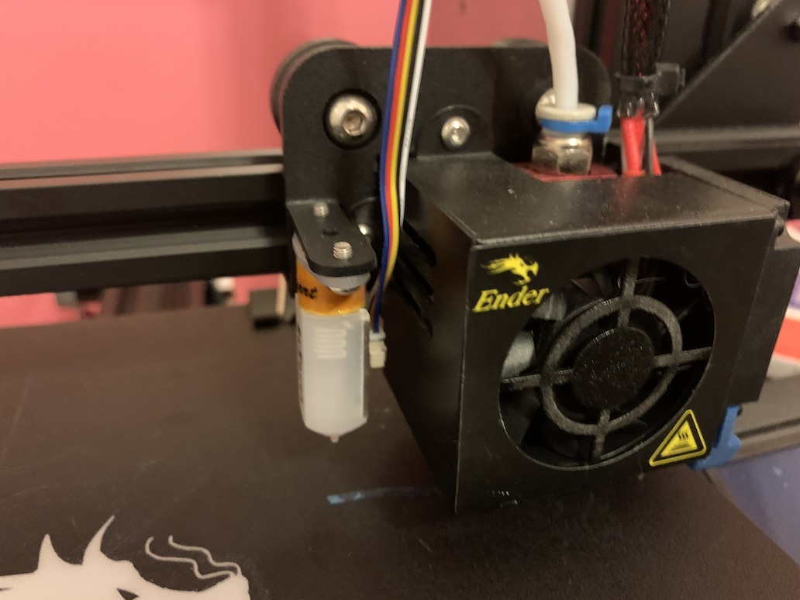
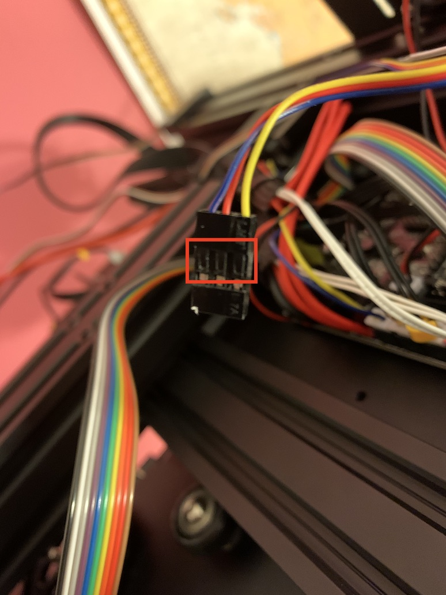
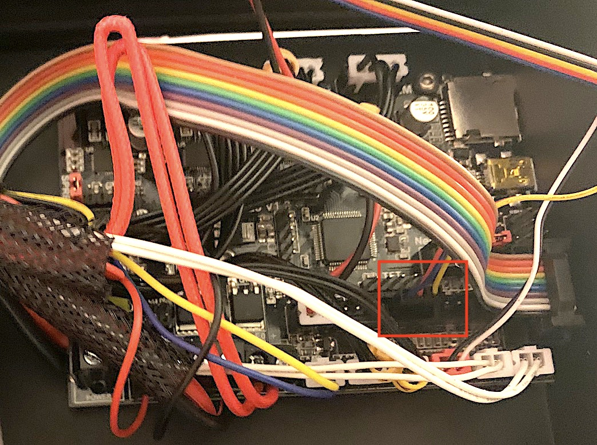
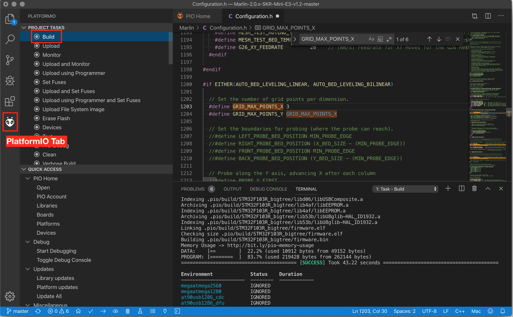

# SKR Mini E3 and BLTouch Setup
Oct 22, 2019

**Heads up: I really recommend reading this all the way through before going step by step through it.**

This documents what I had to do to get my SKR Mini E3 and BLTouch installed and working on my Ender 3 Pro. I'm a software developer but I've never dug into electronics, so my knowledge is limited and I've relied heavily on finding smarter people's guidance to get this to work. One thing I learned is that guides for 3D printers seem to have a short lifespan before the info in them is obsolete. So good luck to you! If you're finding this a year down the road maybe some of it will still be useful, but you might need to do some more digging for up to date information. Reddit has some great communities of people who can help such as [r/ender3](https://www.reddit.com/r/ender3/).

## Hardware

### What I'm Using

I bought this BLTouch kit on [Amazon](https://www.amazon.com/gp/product/B07SCLF42D/ref=ppx_yo_dt_b_asin_title_o04_s00?ie=UTF8&psc=1). And I bought the SKR Mini E3 V1.2 from [BIQU](https://www.biqu.equipment/products/bigtreetech-skr-mini-e3-control-board-32-bit-integrated-tmc2209-uart-for-ender-4?variant=29366499836002).

### Installing the SKR Mini Board

This [Teaching Tech video](https://www.youtube.com/watch?v=-XUQKQnUNig) does a great job explaining how to install the SKR Mini E3 board and the BLTouch, however the BLTouch wire colors might be different. His were yellow, brown and red and mine were yellow, blue and red. In case the wires you have are completely different colors for some reason, I'll clarify the positioning of the wires. With the pins facing you and the wires coming from the top (like you see in the photo below) out-of-the-box the red wire was on the left, then blue in the center, and yellow on the end.

### Installing the BLTouch
I used a mount that came with the BLTouch. But there are many printable mounts on Thingiverse.



When I first got the printer started up, the display and the BLTouch wouldn't turn on. I had to switch the blue and red wires on my BLTouch in order to get it to work (Like the guy in the Teaching Tech video had to do with the brown and red). Apparently there's no standard to wire colors so maybe see if it works first and if not try switching them. To switch the wires, I was able to use the little flathead screwdriver that came with the Ender 3 to carefully pull up the tiny plastic flaps on the connector to the board to pull out the wires and switch them.



Also different from the video, for me the yellow wire had to be closest to the SD card port (the front of the board) and the blue wire (after switching wires) was toward the back of the board.



## Firmware

I couldn't figure out how to get the motherboard updated to new firmware from Teaching Tech's videos. I don't know for sure if this is true but from what I was finding online the new SKR Mini E3 boards can't be updated using the Ardunio IDE like he was using in there. So here's what I did instead.

I started working on the firmware based on this [reddit post](https://www.reddit.com/r/ender3/comments/dfw5ox/skr_mini_e3_v12_board_with_tmc2209_bltouch_link/). If you want to just get going and see if the hardware works (which isn't a bad idea) you can download his [firmware.bin](https://github.com/gazcbm/Marlin-2.0.x-SKR-Mini-E3-v1.2/blob/master/CompiledFirmWare/firmware.bin) file, copy it to an SD card and start up the printer with the SD card installed. This will "flash" the motherboard with the new firmware. Next I'll go through changes I made to the firmware.

### BLTouch Position

When I used the `firmware.bin` above, it worked except the hotend was printing a few millimeters too high. In order to properly work, the firmware needs to know where the BLTouch sensor is in relation to the hotend. What I didn't realize at the time was that you can easily set how high the BLTouch is by turning on the printer and going to Configuration > Z Probe Offset. But since I didn't know that, I downloaded gazcbm's [source code](https://github.com/gazcbm/Marlin-2.0.x-SKR-Mini-E3-v1.2). The Teaching Tech video above describes a little about how to configure the firmware for the BLTouch position. Using a caliper it wasn't hard to get the distance from the hotend to the BLTouch and the setting already in the firmware was close enough, but I had to just do trial and error to figure out the height. 

The offsets I ended up using were:
```
#define X_PROBE_OFFSET_FROM_EXTRUDER -43
#define Y_PROBE_OFFSET_FROM_EXTRUDER -6
#define Z_PROBE_OFFSET_FROM_EXTRUDER -2.125
```

### Touch Points Grid

While I was at it, I wanted to change the number of touch points the probe would hit when calibrating. Out of the box the firmware is set to do a 7x7 grid which takes a while to get through. I found this [Stack Exchange post](https://3dprinting.stackexchange.com/questions/8497/how-to-increase-the-amount-of-probing-points-for-a-bltouch-sensor-in-marlin-firm) which explains you just have to change the `GRID_MAX_POINTS_X` setting in the `configuration.h` file. I set it to 3 while I was tinkering and set it to 5 later when I had it all running smooth for better accuracy.

### Auto Level Before Print

I wanted to auto level the bed before every print but from what I've seen you need to set this up in your slicer software. I mostly use Cura so I found [this video](https://www.youtube.com/watch?v=lJ1PSb8uzB8) showing how to do this. This is an older video and in 4.2.1 you don't need to add the `G28 ; Home All` line because it's already in there. Just add `G29 ;Auto Level` after the home line.

### Editing and Compiling
In order to compile the source code into your own `firmware.bin` file, I followed this guide to [install VSCode and PlatformIO](http://marlinfw.org/docs/basics/install_platformio_vscode.html). Deviating from that a bit and you don't necessarily have to do this, but I skipped everything after step 2. I manually downloaded the [source code](https://github.com/gazcbm/Marlin-2.0.x-SKR-Mini-E3-v1.2) and opened that folder in VSCode. (Then you don't have to mess around with Git if you're not familiar with it.) And the `platformio.ini` file is setup for the SKR Mini E3 already in that source code so you don't have to mess with that. And after I made the above changes to the firmware, I went to the PlatformIO tab and clicked "Build". Once it finished it put a `firmware.bin` file in the project folder under `.pio/build/STM32F103R_bigtree`. I copied that to my SD card, put it in the printer, and started it up.



## BLTouch Error

You might not get this, but I had issues with the BLTouch flashing an error now and then. At first I thought it was an issue with the connection to the motherboard but then I unplugged the connection to the sensor and plugged it back in. That seems to have fixed it.

## That's It!

Hopefully this helps! If you have suggestions for better ways to do this or want clarification on anything, let me know and I'll try to get back to you. 